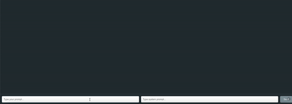

# ReactLLLM (React Local LLM)

ReactLLLM is a basic chat application that allows users to interact with a small language model (SLM) running on a local inference server via [LM Studio](https://lmstudio.ai). This project was bootstrapped with [Create React App](www.github.com/facebook/create-react-app). It is intended to be used as a template for building your own chat application and to explore the capabilities of local language models. The app is built with the following technologies:

- [React](https://reactjs.org/) - for building the UI
- [Axios]() - for making HTTP requests
- [LM Studio](https://lmstudio.ai/)  - for running the local inference server
- [Hugging Face](https://huggingface.co/) - for providing the language models
- [OpenAI](https://openai.com/) - for providing the chat completions API
- [Node.js](https://nodejs.org/en/) - for running the app locally

## Project Motivation

While there are numerous ChatGPT clones that one could simply `git clone`, I wanted to build my own chat application from scratch to better understand how the OpenAI chat completions API works. I also wanted to explore the capabilities of local language models and found that the [LM Studio](https://lmstudio.ai/) platform makes it super easy to run a local inference server. The [Hugging Face](https://huggingface.co/) community provides a wide variety of language models to choose from - I went with the [OpenHermes-2.5-Mistral-7B-GGUF](https://huggingface.co/TheBloke/OpenHermes-2.5-Mistral-7B-GGUF) model because I saw @GeoHot use it on a livestream of [his](https://www.youtube.com/watch?v=2QO3vzwHXhg&ab_channel=georgehotzarchive). it is a relatively small model that runs well on a MacBook Air (M1/16GB). 

## Prerequisites

Before you begin, ensure you have met the following requirements:

- You have a recent version of Node.js installed (> 14.0.0). You can check your version by running `node -v` in the terminal.
- You have downloaded [LM Studio](https://lmstudio.ai/) and have a Local Inference Server running. LM Studio makes this super easy. I've tested with [openhermes-2.5-mistral-7b.Q5_K_S.gguf](https://huggingface.co/TheBloke/OpenHermes-2.5-Mistral-7B-GGUF), but there are [many other](https://huggingface.co/TheBloke) models to choose from. The model you choose will determine the quality of the responses you get from the assistant, but is also dependent upon your hardware. 

## Installation

Follow these steps to install and run the app:

1. Clone the repository: `git clone https://github.com/mgd1984/reactlllm.git`
2. Navigate to the project directory: `cd reactlllm`
3. Install the dependencies: `npm install`

## Running the App

To start the development server, run the following command in the project directory: `npm start`

The app will be available at `http://localhost:3000`.

## Usage

To use the app, simply type your message into the user prompt input field and press the "Send" button. The AI assistant will respond with a message in the chat window. Be sure to also include a system prompt in the system prompt input field which is used to provide context to the AI assistant. 

## App Overview

Our application consists of two main parts: a JavaScript function `sendPromptsStream` and a React component `PromptForm`.

`sendPromptsStream` sends prompts to an AI model and handles the responses. It takes in system and user prompts, sends them to the AI model, and processes the responses. The responses are streamed, decoded, and checked for 'delta' content. If 'delta' content is found, it's added to the response text and passed to a callback function.

`PromptForm` is a chat interface for user interaction. It uses the `marked` library for Markdown formatting and `highlight.js` for syntax highlighting. The component maintains the state of user and system prompts and messages. On form submission, it sends the prompts to the AI model using `sendPromptsStream` and updates the chat with the response.

## Features

- User prompt input field: Allows the user to type a message to the AI assistant.
- System prompt input field: Allows the user to type a system prompt for the AI assistant.
- Chat window: Displays the messages from the user and the AI assistant.

## Local Inference Server Notes

The local HTTP server created via LM Studio emulates the [OpenAI chat completions API](https://platform.openai.com/docs/guides/text-generation/chat-completions-api) which allows you to use the same code for both local and remote inference.

Both streaming and non-streaming usages are supported.

## What are the minimum hardware / software requirements?
- Apple Silicon Mac (M1/M2/M3) with macOS 13.6 or newer
- Windows / Linux PC with a processor that supports AVX2 (typically newer PCs)
- 16GB+ of RAM is recommended. For PCs, 6GB+ of VRAM is recommended
- NVIDIA/AMD GPUs supported

